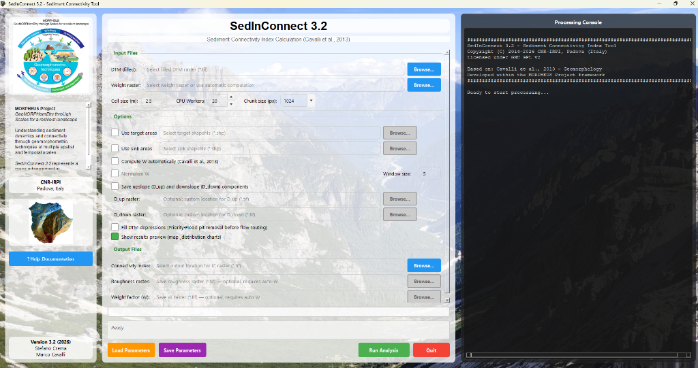

# SedInConnect 3.2 — Stand-alone Sediment Connectivity Assessment

[](https://github.com/HydrogeomorphologyTools/SedInConnect_3.2/releases)
[](LICENSE)
[](https://www.python.org/)
[](qgis_plugin/)
[](python_package/)

> [!NOTE]
> **Preview / Testing Notice:** The QGIS Plugin, ArcGIS Pro Toolbox, and Pip Package distributions are currently in **Beta Testing Phase (Preview)**. User feedback, bug reports, and suggestions are warmly welcome!

**SedInConnect 3.2** is a free, open-source scientific software for computing the **Index of Sediment Connectivity (IC)** (Cavalli et al., 2013; Borselli et al., 2008) in mountain river catchments.

Developed at **CNR-IRPI Padova (Italy)** within the **MORPHEUS PRIN 2023-2026 Project**.



---

## 🌟 Official Ecosystem & Ways to Use SedInConnect 3.2

SedInConnect 3.2 is structured into 3 dedicated execution modalities sharing the **exact same 100% native Numba/NumPy computation engine**:

| Modality | Description | Target Users | Quick Link |
| :--- | :--- | :--- | :--- |
| 🖥️ **Stand-alone Desktop Executable** | Single `.exe` binary for Windows (64-bit). No installation or Python required. | Practitioners, students, GIS users without Python. | [Download Binary](#1-stand-alone-executable-windows) |
| 🗺️ **QGIS Official Plugin & Processing Toolbox** | Full GUI dialog + native QGIS Processing algorithms (with batch mode & Graphical Modeler). | GIS specialists & spatial analysts in QGIS. | [QGIS Plugin Guide](qgis_plugin/) |
| 🐍 **Python Package & Scripting API** | Installable via `pip` with high-level Python API (`import sedinconnect as sic; sic.compute_ic(...)`) and CLI command. | Data scientists, researchers, automation pipelines. | [Python Package Guide](python_package/) |
| 🌐 **ArcGIS Pro Python Toolbox (`.pyt`)** | Native ArcGIS Pro geoprocessing tool with ModelBuilder & `arcpy` scripting support. | ArcGIS Pro specialists & ESRI workflows. | [ArcGIS Toolbox Guide](arcgis_toolbox/) |

---

## 🚀 1. Stand-alone Executable (Windows)

No Python environment or dependencies required. Download the pre-compiled executable from the [GitHub Releases](https://github.com/HydrogeomorphologyTools/SedInConnect_3.2/releases):

* 📂 **`SedInConnect_3.2.exe`** (~220 MB)

Simply double-click to launch the GUI, or run via command line:
```cmd
SedInConnect_3.2.exe --dtm "dtmfel.tif" --cell-size 2.5 --output "ic.tif" --target "target.shp" --auto-weight --window-size 3
```

---

## 🗺️ 2. QGIS Official Plugin & Processing Toolbox

Located in the [`qgis_plugin/`](qgis_plugin/) subfolder.

* **Dedicated Dialog:** Select layers directly from the active QGIS project.
* **Cold-to-Hot Stretched Colormap:** Automatically styles output IC rasters upon completion (Lapislazuli Blue ➔ Cyan ➔ Yellow ➔ Orange ➔ Vibrant Red).
* **Processing Toolbox:** Found under `Processing Toolbox ➔ SedInConnect ➔ Calculate Sediment Connectivity Index (IC)`.
* **Automatic Dependency Installer:** Automatically installs `numba` into QGIS Python if missing.

👉 **[Read the Full QGIS Plugin Documentation & Installation Guide](qgis_plugin/)**

---

## 🐍 3. Python Package & Programmatic API

Located in the [`python_package/`](python_package/) subfolder.

Install via `pip`:
```bash
pip install sedinconnect
# or directly from GitHub:
pip install git+https://github.com/HydrogeomorphologyTools/SedInConnect_3.2.git#subdirectory=python_package
```

Use in Python scripts:
```python
import sedinconnect as sic

ic_file = sic.compute_ic(
    dtm="test_data/dtmfel.tif",
    target="test_data/target.shp",
    output="ic_output.tif",
    window_size=3
)
```

👉 **[Read the Full Python Package API Documentation](python_package/)**

---

## 📦 Sample Test Dataset

A complete reference dataset is included in [`test_data/`](test_data/):
* `dtmfel.tif`: High-resolution Pit-Filled Digital Elevation Model (2.5 m resolution, Strimm/Gadria catchment).
* `target.shp`: Target river stream network polyline shapefile.
* `sink_strimm_gadria.shp`: Retention basin / internal sink polygon shapefile.
* `ic_target_w3.tif`: Precomputed reference connectivity index raster ($3 \times 3$ window).
* `params_example_w3.json`: Example parameters JSON ready to load in GUI or CLI.

---

## ⚡ Native Engine Highlights (v3.2)

* **Pure Native Hydrological Flow Routing:** Zero external C++ or MPI binary dependencies (no TauDEM required).
* **Two-Stage Multi-Pass Flat Area Resolution:** Implements the complete Garbrecht & Martz (1997) iteration for complex artificial flat zones and lakes.
* **Unified Single-Pass AreaDinf Accumulation:** High-performance topological queue processing.
* **Execution Run History (`sedinconnect_runs.log`):** Granular `[HH:MM:SS]` timestamps and macro-stage breakdowns for full scientific reproducibility.
* **Anonymous Telemetry:** Non-blocking, privacy-preserving usage monitoring for research impact reporting.

---

## 🇪🇺 Funding & Acknowledgements

Developed as part of the research activities within the project:  
**PRIN 2022: PROGETTI DI RICERCA DI RILEVANTE INTERESSE NAZIONALE – Bando 2022**  
* **Project Title:** MORPHEUS - GeoMORPHomEtry throUgh Scales for a resilient landscape (PRIN 2023-2026)  
* **Protocol:** 2022JEFZRM  
* **Funded by:** European Union - NextGenerationEU, Ministero dell'Università e della Ricerca (MUR), and Italia Domani (PNRR).

---

## 📚 Scientific References

If you use SedInConnect in your scientific research, please cite:

1. **Cavalli, M., Trevisani, S., Comiti, F., & Marchi, L. (2013).** Geomorphometric assessment of spatial sediment connectivity in small Alpine catchments. *Geomorphology*, 188, 31-41. [doi:10.1016/j.geomorph.2012.05.007](https://doi.org/10.1016/j.geomorph.2012.05.007)
2. **Crema, S., & Cavalli, M. (2018).** SedInConnect: a stand-alone, free and open source tool for the assessment of sediment connectivity. *Computers & Geosciences*, 111, 39-45. [doi:10.1016/j.cageo.2017.10.009](https://doi.org/10.1016/j.cageo.2017.10.009)
3. **Borselli, L., Cassi, P., & Torri, D. (2008).** Prolegomena to sediment connectivity: Thinking with the flow. *Catena*, 75(3), 268-277. [doi:10.1016/j.catena.2008.07.006](https://doi.org/10.1016/j.catena.2008.07.006)

---

## 🌐 4. ArcGIS Pro Python Toolbox (`.pyt`)

Located in the [`arcgis_toolbox/`](arcgis_toolbox/) subfolder.

* **Native Geoprocessing Tool:** Add `SedInConnect.pyt` directly to the ArcGIS Pro Catalog Pane (Toolboxes ➔ Add Toolbox).
* **ModelBuilder & arcpy Support:** Seamlessly connect SedInConnect into ESRI geoprocessing models and automated scripts.

👉 **[Read the Full ArcGIS Pro Toolbox Documentation](arcgis_toolbox/)**
