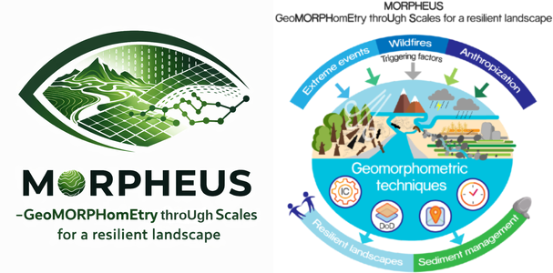
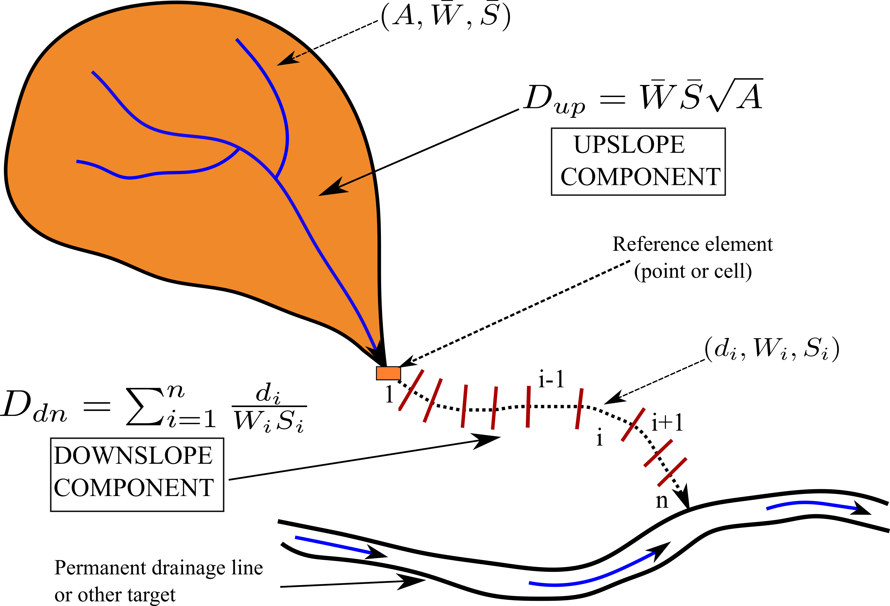

# SedInConnect 3.2

**Sediment Connectivity Index (IC) Calculation Tool**  
*Developed by CNR-IRPI Padova (Italy)*

<p align="center">
  
</p>

---

## 🌟 Overview

**SedInConnect 3.2** is a professional geomorphometric software designed to quantify sediment connectivity in catchments. Based on the methodology by **Cavalli et al. (2013)** and **Borselli et al. (2008)**, it calculates the **Index of Connectivity (IC)** to evaluate the potential for sediment transfer from source areas (hillslopes) to designated targets (channel networks, retention basins, infrastructures, or catchment outlets).

Version **3.2** represents a milestone release featuring a **100% native Python/Numba computational core**, eliminating any external dependencies on TauDEM or MS-MPI while maintaining **exact numerical consistency** with reference hydrogeomorphometric models.

<p align="center">
  
  <br>
  <i>Figure: SedInConnect Graphical User Interface</i>
</p>

---

## 📐 Theoretical Background & Connectivity Schema

Sediment connectivity describes the degree of linkage that facilitates the transfer of sediment through a landscape. The **Index of Connectivity (IC)** is defined as:

$$\text{IC} = \log_{10} \left( \frac{D_{up}}{D_{down}} \right)$$

<p align="center">
  
  <br>
  <i>Figure: Conceptual components of the Sediment Connectivity Index (IC) (adapted from Borselli et al., 2008 and Cavalli et al., 2013)</i>
</p>

### 1. Upslope Component ($D_{up}$)
Quantifies the potential for sediment routing driven by upslope contributing area ($A$), average upslope slope gradient ($\overline{S}$), and average surface impedance ($\overline{W}$):
$$D_{up} = \overline{W} \cdot \overline{S} \cdot \sqrt{A}$$

### 2. Downslope Component ($D_{down}$)
Quantifies the travel path resistance of sediment moving from the cell along the flow path to the designated target or outlet:
$$D_{down} = \sum_{i} \frac{d_i}{W_i \cdot S_i}$$
where $d_i$ is the length of cell $i$ along the flow path, $W_i$ is the local surface weighting factor, and $S_i$ is the local slope gradient (clamped to a minimum of $0.005$ to avoid division by zero).

### 3. Surface Weighting Factor ($W$)
When calculated automatically (**Cavalli et al., 2013**), the surface roughness index ($RI$) is computed as the standard deviation of residual elevation in a moving window ($N \times N$, default 5):
$$RI = \text{std}(DTM - \mu_{local})$$
$$W = 1.0 - \left( \frac{RI}{RI_{max}} \right) \quad \text{with } W \ge 0.001$$

Optional logarithmic normalization (**Trevisani & Cavalli, 2016**):
$$W_{norm} = 1.0 - \left[ \frac{\ln(RI) - \ln(RI_{min})}{\ln(RI_{max}) - \ln(RI_{min})} \right]$$

---

## ✨ Key Features & What's New in Version 3.2

* **⚡ 100% Native High-Performance Core:** Complete Python/Numba vectorized algorithms for D8 and D-infinity flow routing ($D_\infty$, Tarboton, 1997), flat area resolution (Garbrecht & Martz, 1997), and weighted downslope distance transforms ($D_{down}$). **No external compiled tools (TauDEM, MS-MPI) required!**
* **🔄 Chunk-Invariant Processing:** Tile-based spatial chunking (1024, 2048, 4096 px) enables processing of massive LiDAR grids (100M+ cells) on standard workstations with strict **bitwise mathematical invariance** across chunk sizes.
* **💻 Multi-Core Parallel Acceleration:** Configurable CPU worker processes (`--workers`) for high-throughput spatial convolution and surface roughness calculation.
* **🎨 Modern User Interface:** Enhanced PyQt5 interface with high-DPI vector icons, streamlined input fields, friendly validation alerts, and responsive progress reporting.
* **📊 Interactive Results Visualizer:** Built-in preview dialog featuring the continuous IC map, frequency distribution histogram, descriptive statistics (mean, median, standard deviation), and export tools for publication-ready figures (PNG/PDF).
* **💾 Diagnostic Component Export:** Dedicated options to export intermediate rasters ($D_{up}$, $D_{down}$, Cavalli Roughness $RI$, and Weight factor $W$).
* **🗂️ Preserved Legacy Code:** Codebases for **v3.0** and **v3.1** are preserved under the [`legacy/`](legacy/) directory for historical reproducibility.

---

## 🚀 How to Use

### 1. GUI Mode (Interactive)
The recommended way for most users. Run the main script to launch the interface:
```bash
python main.py
```
* **Input Selection:** Easily browse for your DTM (Digital Terrain Model), Weighting factors, Targets (e.g., rivers, lakes), and Sinks (e.g., pits, dams).
* **Interactive Configuration:** Set moving window sizes for roughness calculation and choose between Cavalli (2013) weight or custom weight rasters.
* **Real-time Monitoring:** Watch the progress and detailed logs in the dedicated right-hand pane.
* **Session Management:** Save and Load your processing parameters as JSON files for reproducibility.

### 2. CLI Mode (Automation)
For batch processing, HPC clusters, or integration into automated GIS workflows:
```bash
# Basic run with automatic Cavalli roughness weight
python main.py --dtm "path/to/dtm_filled.tif" --cellsize 2.5 --output "path/to/ic.tif" --auto-weight

# Advanced run with targets, sinks, parallel workers, and component export
python main.py --dtm "dtm_filled.tif" \
               --cellsize 2.5 \
               --output "ic.tif" \
               --target "streams.shp" \
               --sink "sinks.shp" \
               --auto-weight \
               --normalize \
               --window-size 5 \
               --save-components \
               --workers 8 \
               --chunk-size 1024

# Using a saved JSON parameter file
python main.py --params "my_parameters.json"
```

#### Available CLI Arguments:
| Argument | Description |
| :--- | :--- |
| `--dtm <path>` | Path to hydrologically conditioned input DTM (GeoTIFF) |
| `--cellsize <float>` | Raster cell resolution in meters |
| `--output <path>` | Destination path for output IC GeoTIFF |
| `--target <path>` | (Optional) ESRI Shapefile (`.shp`) defining target areas/channels |
| `--sink <path>` | (Optional) ESRI Shapefile (`.shp`) defining internal sinks/pits |
| `--weight <path>` | (Optional) Path to custom weighting factor raster (GeoTIFF) |
| `--auto-weight` | Automatically compute weight from surface roughness (Cavalli et al., 2013) |
| `--normalize` | Apply logarithmic normalization to roughness (Trevisani & Cavalli, 2016) |
| `--window-size <int>` | Moving window size for roughness (odd integer $\ge 3$, default 5) |
| `--save-components` | Export intermediate $D_{up}$ and $D_{down}$ component rasters |
| `--workers <int>` | Number of parallel CPU workers for spatial convolution |
| `--chunk-size <int>` | Processing tile size in pixels (e.g. 1024, 2048, 4096) |
| `--fill-dtm` | Automatically run Priority-Flood depression filling |
| `--params <path>` | Load processing parameters from a JSON configuration file |

---

## 📥 Installation & Requirements

### Standalone Executable (Windows)
Pre-compiled standalone executables are available on the **[Releases Page](../../releases)**.  
*No Python installation, GDAL setup, or external dependencies required.*

1. Download **`SedInConnect_3.2.exe`** from the latest Release.
2. Double-click the executable to launch the GUI.

### Running from Source
```bash
# Clone the repository
git clone https://github.com/HydrogeomorphologyTools/SedInConnect_3.2.git
cd SedInConnect_3.2

# Install dependencies
pip install -r requirements.txt

# Run SedInConnect
python main.py
```

---

---

## 📂 Sample Test Dataset

A sample dataset is provided in the [	est_data/](test_data/) directory for testing and verification:
* **dtmfel.tif:** Sample hydrologically conditioned DTM (2.5 m resolution).
* **	arget.shp:** Stream channel network target shapefile.
* **sink_strimm_gadria.shp:** Example internal sink / retention basin shapefile.
* **ic_target_w3.tif:** Reference Index of Connectivity raster computed with automatic Cavalli weight ( \times 3$ window).
* **
oughness_w3.tif & weight_w3.tif:** Reference intermediate surface roughness ($) and weighting factor ($) rasters.
* **params_example_w3.json:** Example configuration file ready to be loaded in the GUI via **Load Parameters** or via CLI with --params.

## 🇪🇺 Funding & Acknowledgements

This software has been developed as part of the research activities within the project:  
**PRIN 2022: PROGETTI DI RICERCA DI RILEVANTE INTERESSE NAZIONALE – Bando 2022**

* **Project Title:** MORPHEUS - GeoMORPHomEtry throUgh Scales for a resilient landscape
* **Protocol:** 2022JEFZRM
* **Financed by:** European Union - NextGenerationEU, Ministero dell'Università e della Ricerca (MUR), and Italia Domani (PNRR)

We acknowledge the financial support provided by the Italian Ministry of University and Research and the European Union under the NextGenerationEU framework and the Italia Domani (Piano Nazionale di Ripresa e Resilienza) initiative.

> **Official Reference:**  
> NATIONAL RECOVERY AND RESILIENCE PLAN (NRRP) – MISSION 4  
> COMPONENT 2 INVESTMENT 1.1 – “Fund for the National Research Program and for Projects of National Interest (PRIN)”

---

## 📚 References & Citations

If you use **SedInConnect** in your research, please cite:

* **Cavalli, M., Trevisani, S., Comiti, F., & Marchi, L. (2013).** Geomorphometric assessment of spatial sediment connectivity in small Alpine catchments. *Geomorphology*, 188, 31-41. [doi:10.1016/j.geomorph.2012.05.007](https://doi.org/10.1016/j.geomorph.2012.05.007)
* **Crema, S., & Cavalli, M. (2018).** SedInConnect: a stand-alone, free and open source tool for the assessment of sediment connectivity. *Computers & Geosciences*, 111, 39-45. [doi:10.1016/j.cageo.2017.10.009](https://doi.org/10.1016/j.cageo.2017.10.009)
* **Borselli, L., Cassi, P., & Torri, D. (2008).** Prolegomena to sediment connectivity: Thinking with the flow. *Catena*, 75(3), 268-277. [doi:10.1016/j.catena.2008.07.006](https://doi.org/10.1016/j.catena.2008.07.006)
* **Trevisani, S., & Cavalli, M. (2016).** Topography-based flow-direction modeling: how much does spatial resolution matter? *Earth Surface Processes and Landforms*, 41(5), 658-670. [doi:10.1002/esp.3854](https://doi.org/10.1002/esp.3854)
* **Tarboton, D. G. (1997).** A new method for the determination of flow directions and upslope areas in grid digital elevation models. *Water Resources Research*, 33(2), 309-319.
* **Garbrecht, J., & Martz, L. W. (1997).** The assignment of drainage direction over flat surfaces in raster digital elevation models. *Journal of Hydrology*, 193(1-4), 204-213.

---

**Authors:** Stefano Crema & Marco Cavalli  
**Institution:** CNR-IRPI (National Research Council - Research Institute for Geo-Hydrological Protection), Padova, Italy  
**License:** GNU General Public License v2 (GPLv2)
